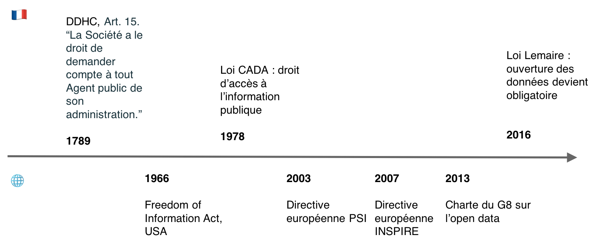
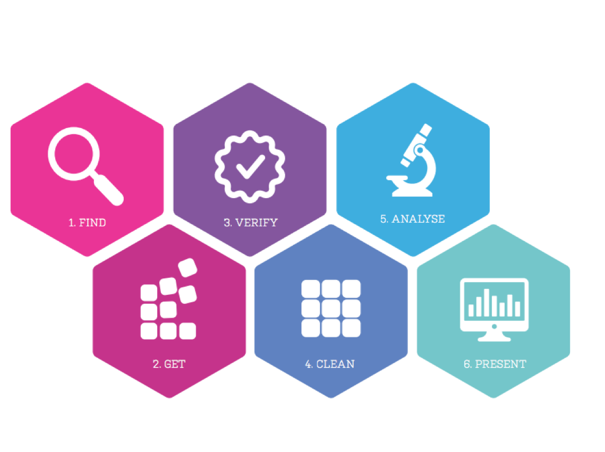
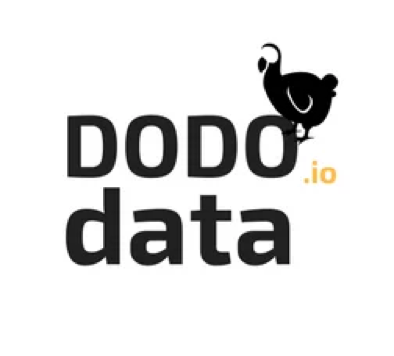
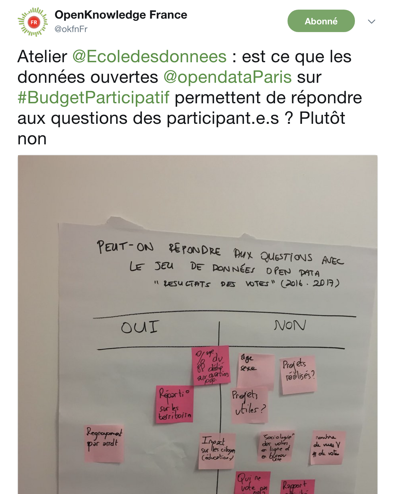
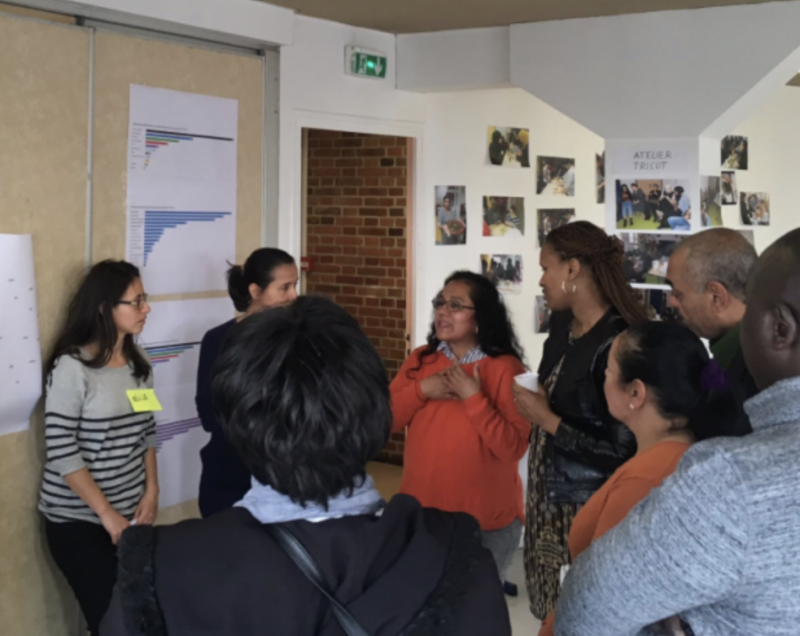

class: center, middle

Cette présentation est en ligne et librement réutilisable : http://datactivi.st/irfedd/

Toutes les sources figurent ici : http://github.com/datactivist/irfedd/

Le contenu créé par Datactivist est placé sous la licence [Creative Commons CC-BY-SA ](https://creativecommons.org/licenses/by-sa/3.0/deed.fr). 

---
# Qui suis-je?
.pull-left[- Spécialiste de l’open data : j’ai cofondé [Datactivist](datactivi.st), une société coopérative qui a pour mission d’ouvrir des données et de les rendre utiles. 

- Militant de l’ouverture, j’ai co-fondé [Open Knowledge France](okfn.fr). 

- Chercheur sur l’open data, j’ai fait ma thèse de doctorat en sociologie ["Instaurer des données, instaurer des publics : une enquête sociologique dans les coulisses de l'open data"](https://pastel.archives-ouvertes.fr/tel-01458098) sur le sujet. 
]
.pull-right[

]

---
# Open data : un cadre juridique ancien

---
## Il y a 10 ans, la promesse d'une réduction des asymétries d'information
.pull-left[
📣 Toutes les données en ligne et librement réutilisables gratuitement par défaut

📣 Des données "fraiches", à jour

📣 Des données brutes et non agrégées, au plus haut niveau de granularité

📣 Des données publiées volontairement 

.footnote[📆 Rdv le 7/12 à Paris : [www.datactivi.st/datanniversaire](www.datactivi.st/datanniversaire)]
]
.pull-right[] 

---
# 10 ans plus tard, des politiques d'open data "de l'offre"
.pull-left[
## En théorie

### Toutes les données sont ouvertes sous leur forme brute dès leur production

]
.pull-right[

## En pratique

###L’administration choisit quelles données ouvrir, comment les ouvrir, quand et ce qu’elles contiennent

]
---
# L'existence d'un public pour les données : un présupposé de l'open data

---
## La réutilisation : un parcours fait de frictions et de déceptions
.pull-left[

]
.pull-right[
####  Des données difficiles à trouver, pas ouvertes partout

####  Granularité temporelle et spatiale souvent trop faible

####  Des données souvent inutilisables : manque de documentation

####  Des données pas mises à jour

####  Des portails qui ciblent les développeurs

]

---
# Open Data Barometer : le problème de la qualité
.pull-left[
>**Government data is usually incomplete, out of date, of low quality, and fragmented.** In most cases, open data catalogues or portals are manually fed as the result of informal data management approaches. **Procedures, timelines, and responsibilities are frequently unclear among government institutions tasked with this work.**
.footnote[http://opendatabarometer.org/4thedition/report/]
]
.pull-right[

]
---
#Open Data Index : des données bien cachées
.pull-left[
> Data findability is a major challenge. We have data portals and registries, but government agencies under one national government still publish data in different ways and different locations. Moreover, they have different protocols for license and formats(…)
**Data findability is a prerequisite for open data to fulfill its potential and currently most data is very hard to find.**
]
.pull-right[

.footnote[https://index.okfn.org/insights/]
]

---
class:middle, center
 
---
class:center
# Le data scientist : un oiseau rare 🦄 
.reduite[]
---
class:center
#Réutiliser des données : des compétences complexes à acquérir  

.reduite[]
---
class:inverse, middle, center, inverse

# Alors, que faire ? 

---
# DODOdata pour réveiller les données qui dorment
.pull-left[

]
.pull-right[
📣 Une plateforme qui permet de simplifier radicalement les Demandes d’Ouverture de Données (DODO)

📩 Des demandes précises, rédigées automatiquement pour des données sélectionnées

📥 Une plateforme qui facilite le traitement des demandes et guide les administrations dans l’ouverture de leurs données

]
---
class:middle, center
## Ecole des données : des ateliers pour rapprocher les données des citoyens

.pull-left[]
.pull-right[]
---
class:middle, center, inverse

## Conclusion

### L'open data par défaut ne se fera pas sans médiation numérique

.footnote[Voir [notre formation avec ARSENIC "Réaliser des actions de médiation à la donnée"](http://arsenicpaca.fr/wp-content/uploads/2017/10/F03-R%C3%A9aliser-des-actions-de-m%C3%A9diation-%C3%A0-la-donn%C3%A9e-MedData.pdf) ]
---
class:inverse, middle, center
# Merci ! 

## Des questions ? 

.footnote[Vous pouvez me contacter à l'adresse samuel@datactivi.st]